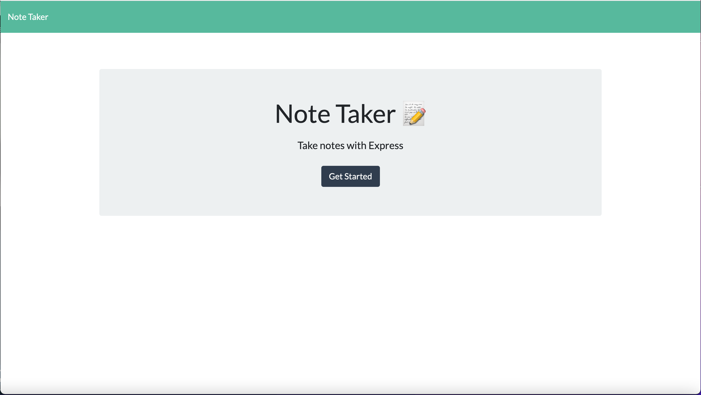
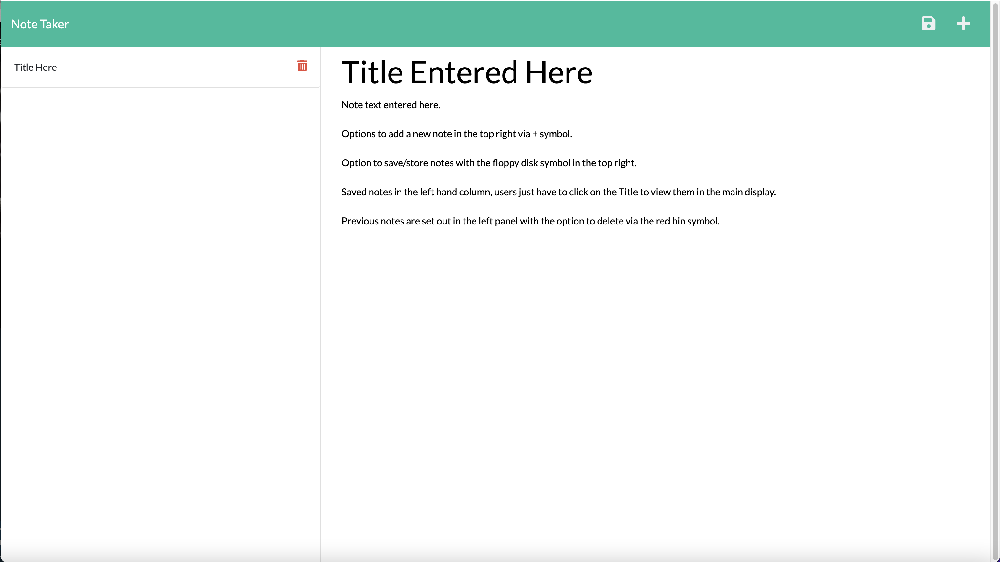
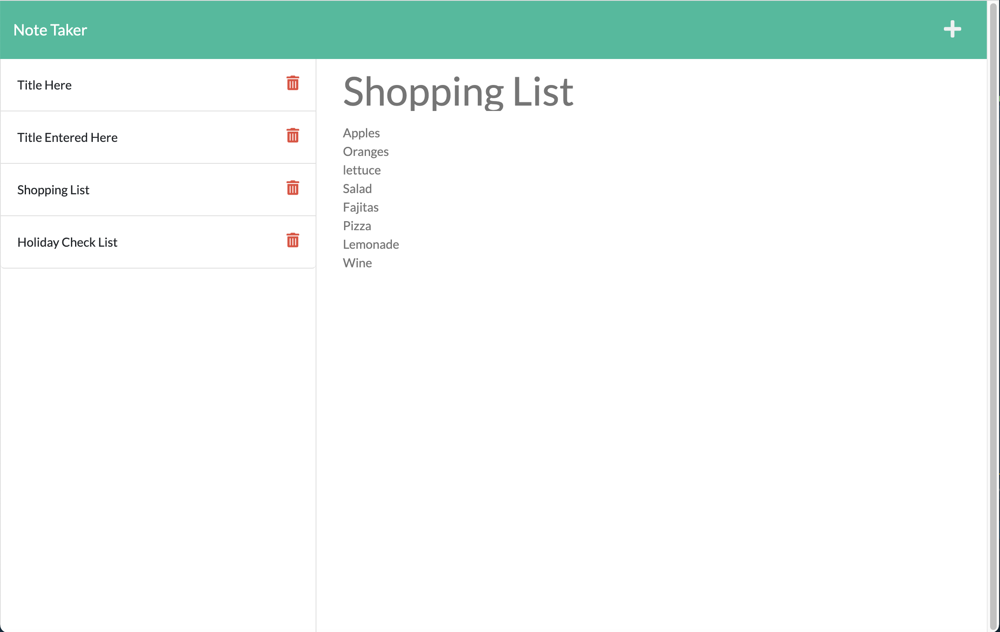

# Note-Taker-with-Express.js

## GitHub Username

  NKC27

# Table of Contents

- [Profile_link](#Profile_link)
- [Description](#Description)
- [Installation](#Installation)
- [Usage](#Usage)
- [Live_link](#Live_link)
- [Screenshots](#Screenshots)
- [Video](#Video_Walkthrough)
- [Licence](#Licence)
- [Contributions](#Contributions)

# Profile_Link

Please see my profile for further documentation.
[GitHub Link](https://github.com/NKC27)

## Description

--------
I have created an application called Note Taker that can be used to write and save notes. This application will use an Express.js back end and will save and retrieve note data from a JSON file.

The application’s front end has already been created. It's my job to build the back end, connect the two, and then deploy the entire application to Heroku.

## Installation

```
Clone Repo from NKC27 gitHub in your Terminal:
git clone git@github.com:NKC27/Note-Taker-with-Express.js.git

Switch to the correct directory (folder) in your Terminal:
cd Note-Taker-with-Express.js

Install all dependencies from the package.json:
npm install

Run the App
npm run start or 
node server.js

Go to your localHost:
http://localhost:3001
```

## Usage

```
-- HTML
-- CSS
-- Javascript
-- Bootstrap
-- JQuery
-- Node.js
-- Express.js
-- uuid

```

## Live_link

[Note_Taker_App](https://note-taker-nkc.herokuapp.com)

## Screenshots

The following images show the web application's appearance and functionality:







## Video_Walthrough

[](https://www.youtube.com/watch?v=Jw027qm2n8o)

## Licence


## Contributions

This repository is open to contributions.
